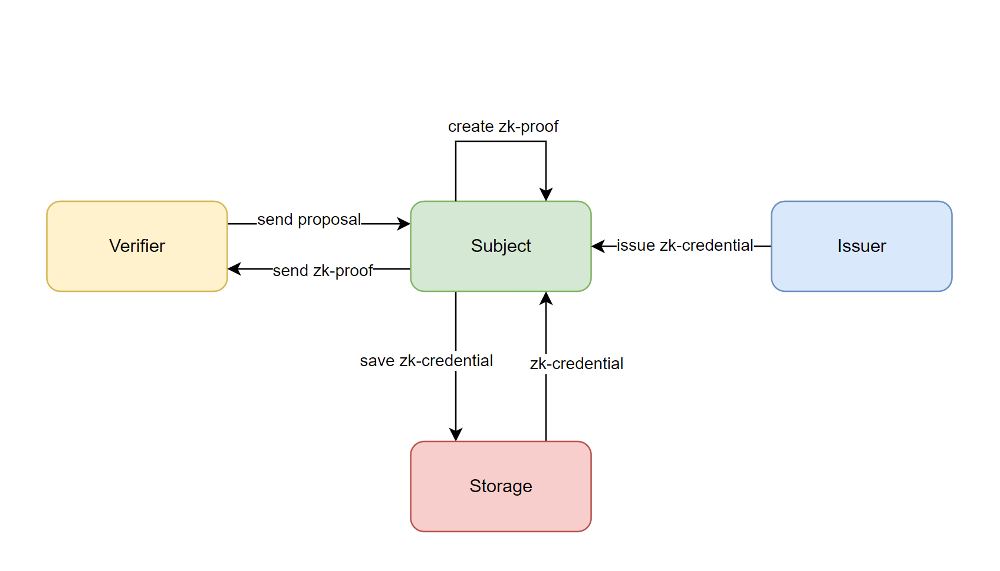

## Abstract

The protocol establishes the basic principles governing zero-knowledge
credential architectures and defines the data structure of these
credentials. It illustrates how zk-credentials can achieve compatibility
with various zero-knowledge proof systems such as zk-SNARKs or
zk-STARKs. The transformation graph plays a crucial role in facilitating
this compatibility. It defines how zk-credentials can be transformed or
adapted to suit the distinct requirements of different zero-knowledge
proof systems.

## Motivation

This protocol is necessary to provide the subject with the ability to
confirm their attributes in the digital space without disclosing the
attributes themselves. This allows the subject to avoid leaving a
digital trace of their identity in the digital space and gives them
complete control over their representation in the digital world.

Furthermore, in ideological terms, this protocol brings us closer to a
future where the concept of
[self-sovereign identity](https://github.com/WebOfTrustInfo/self-sovereign-identity/blob/master/self-sovereign-identity-principles.md)
makes more sense than the current state of affairs with the
[verifiable credentials](https://www.w3.org/TR/vc-data-model-2.0/)
[(VCs) data model by W3C](https://www.w3.org/TR/vc-data-model-2.0/).

Another important goal of this protocol is to create a digital
environment where the subject can use digital credentials to confirm
their attributes wherever possible – in a centralized application, smart
contract, zero-knowledge application, etc. This is another crucial issue
that the [VCs specification](https://www.w3.org/TR/vc-data-model-2.0/)is
unable to address.


## Specification

The key words "MUST", "MUST NOT", "REQUIRED", "SHALL", "SHALL NOT",
"SHOULD", "SHOULD NOT", "RECOMMENDED", "NOT RECOMMENDED", "MAY", and
"OPTIONAL" in this document are to be interpreted as described in [RFC
2119](https://datatracker.ietf.org/doc/html/rfc2119) and
[RFC 8174](https://datatracker.ietf.org/doc/html/rfc8174).


### Architecture

#### Basic terms

`Subject` – entity that has a set of attributes in the digital area, it
can be human, animal, things and etc.

`ZK-Credential` – credentials serve as proof of subject attributes in
the digital domain and must be issued by a trusted `issuer`. These
credentials validate specific qualities or information about the
`subject`.

`Issuer` – entity that has the capability to check `subject` attributes
and issue ZKCs. These credentials are designed to provide proof of
specific attributes or qualities associated with the `subject`. The
`issuer` plays a critical role in ensuring the authenticity and
integrity of the credentials

`Storage` – entity that store data. It can take various forms such as
local, centralized, or decentralized storage systems.

`Verifier` – entity that want to verify statement about `subject`

`Constraints` – set of conditions that `zk-credential` has to be matched

`ZK credential proof` – cryptographic zk-statement proving that
`subject` has attributes in `zk-credential` that match to `constraints`

`Proposal` - data structure that includes details regarding
`constraints`, `zk-credential`, `verifier`, and the `subject
identifier`. The subject has the option to either reject or accept the
verifier's `proposal`. If the subject accepts the proposal, it generates
a `zk-credential proof` based on the specified `constraints`.

#### Main Flow

Based on the definitions introduced above, the main flow is described as
follows:

**Step 1:** `Verifier` formulates `constraints` and sends a `proposal`
request to the `subject`.

**Step 2.1:** If the `subject` rejects the `proposal`, the process halts
at this stage.

**Step 2.2:** If the `subject` lacks a matching `zk-credential` for the
`constraints`, the `subject` requests the `issuer` to generate the
necessary `zk-credential`. Upon issuance, the `issuer` sends the
`zk-credential` to the `subject`. The `subject` then stores the
`zk-credential` in `storage`, and proceeds to step 2.3.

**Step 2.3:** If the subject already holds a `zk-credential` that
satisfies the `constraints`, the `subject` then generates a
`zk-credential proof` and proceeds to step 3.

**Step 3:** The `subject` sends the generated `zk-credential proof` to
the `verifier`.

**Step 4:** The `verifier` validates the received `zk-credential proof`.

The process described above is illustrated in the diagram below.



### Identifier

An `identifier` is a data structure that refers to any entity.
`Identifier` contains information about `type` of public key or
blockchain address, along with the `key`, which can be a public key or a
blockchain address. An identifier `type` and `key` MUST be a string.

Examples:

```json
{
  "type": "ethereum:address",
  "key": "0x67a4a8aE79aD76f6978455bDA38451F16E4DD06E"
}
```

```json
{
  "type": "mina:address",
  "key": "B62qokENrriEU3XWkob65JcbbcLLMKBvM2HRwx7sPdahjkqjXnXZPaA"
}
```

### Attributes

Each `zk-credential` MUST contain an `attributes` property. The
`attributes` property is an object that must include the following
properties: `type`, `issuanceDate`, `validFrom`, `validUntil`, and
`subject`. While `zk-credential` `attributes` can include other
properties, the ones listed above are mandatory.

#### Type attribute

The `type` is `attributes` property that defines `zk-credential` purpose
and other properties. `type` property value MUST be a string.

Example of the zk-credential with attributes property:

```json
{
  "attributes": {
    "type": "passport",
    "issuanceDate": "2023-12-18T13:57:50.582Z",
    "validFrom": "2023-12-18T13:57:50.582Z",
    "validUntil": "2030-12-18T13:57:50.582Z",
    "subject": {
      "id": {
        "type": "ethereum:address",
        "key": "0x67a4a8ae79ad76f6978455bda38451f16e4dd06e"
      },
      "name": "John",
      "birthDate": "2000-01-01"
    }
  }
}
```

#### Issuance date attribute

The `issuanceDate` property represents the date and time when the
`zk-credential` was issued and MUST be represented as a string according
to the
[ISO 8601 date and time format](https://www.iso.org/iso-8601-date-and-time-format.html).

#### Valid from attribute

The `validFrom` property represents the date and time from which the
`zk-credential` becomes valid. The `validFrom` property MUST be
represented as a string according to the
[ISO 8601 date and time format](https://www.iso.org/iso-8601-date-and-time-format.html).

#### Valid until attribute

The `validUntil` property represents the date and time from which the
`zk-credential` becomes invalid. The `validUntil` property MUST be
represented as a string according to the
[ISO 8601 date and time format](https://www.iso.org/iso-8601-date-and-time-format.html).

#### Subject attribute

The `subject` property represents `subject` attributes and properties.
The `subject` property is object that MUST includes `id` property, where
value is [`identifier`](#identifier), other properties are optional.

Example of the zk-credential with attributes property:

```json
{
  "attributes": {
    "type": "passport",
    "issuanceDate": "2023-12-18T13:57:50.582Z",
    "validFrom": "2023-12-18T13:57:50.582Z",
    "validUntil": "2030-12-18T13:57:50.582Z",
    "subject": {
      "id": {
        "type": "ethereum:address",
        "key": "0x67a4a8ae79ad76f6978455bda38451f16e4dd06e"
      },
      "name": "John",
      "birthDate": "2000-01-01"
    }
  }
}
```

#### Limitations

- In the `zk-credential attributes`, it is mandatory that all properties
  be explicitly defined and cannot have optional values. All properties
  MUST either be specified with definite values or have predefined
  defaults.
- JSON list data structures are not permitted within `zk-credential
  attributes`. These attributes should exclusively consist of string,
  number, boolean, or object values.

### Transformation Graph

#### Purpose

The [`attributes`](#attributes) and other properties within the
`zk-credential` may not align with zero-knowledge proof systems like
zk-SNARKs or zk-STARKs. To establish compatibility between
`zk-credential` and various zero-knowledge proof systems, an
introduction of a `transformation graph` is necessary. The
`transformation graph` converts `zk-credential` `attributes` and other
properties into a format that is suitable for a specific zero-knowledge
proof system.

#### Transformation graph variable

`variable` - value that can be anything - string, number, boolean,
object or other.

#### Transformation graph node

`graph node` - defines the parameters and properties of a `variable`
that allow categorizing it under a specific type (`node`) within the
`transformation graph`.

For instance, for a `variable` like `"hello"`, it might be associated
with `graph nodes` such as `"ascii"` and `"utf8"`, but it cannot belong
to the `"boolean"` `graph node`.

The name of a `graph node` MUST adhere to the following regular
expression:

```typescript
/([0-9a-zA-Z]+?:)?([0-9a-zA-Z]([0-9a-zA-Z\.]+)?[0-9a-zA-Z])/
```

Name examples:

- utf8
- mina:field
- boolean
- super:uint512

#### Transformation graph link

`graph links` - functions that transform `variable's` value into another
`variable's` value, ensuring the transformed `variable` is suits the
desired `graph node`. Essentially, `graph links` facilitate the
conversion of one `variable` representation to another.

For example, `graph links` such as `utf8-bytes` convert the string
`variable` `"hello"` into a bytes `variable` `[48 65 6c 6c 6f]`. Prior
to the transformation, the `variable` is `"hello"` with its `graph node`
designated as `utf8`. Following the transformation, the `variable`
becomes bytes `[48 65 6c 6c 6f]`, now linked with the `graph node`
`bytes`.

There are three types of `graph links`:

- `modify links` - these links alter the `variable` while retaining the
  same `graph node`. For instance, if the `variable` value is a number
  equal to `65536` and the `graph node` is `uint`, a graph link such as
  `mod.uint16` executes modular division of the `variable` value by
  `65535`. The resulting modified `variable` value is `1`, and the
  `graph node` remains as `uint`.
- `change link` - these links transform both the `graph node` and the
  `variable`. For example, if the `variable` value is the string
  `"hello"` and the `graph node` is `utf8`, applying the graph link
  `utf8-bytes` transforms the `variable` value to `[48 65 6c 6c 6f]` and
  changes the `graph node` to `bytes`.
- `empty links` - these links solely modify the `graph node` without
  altering the `variable` value.

`Change link` names and `empty link` names MUST adhere to the following
format: `<graph_node_name>-<graph_node_name>`.

Here are examples of valid `change link` and `empty link` names:

- utf8-bytes
- mina:signature-mina:field
- base58-mina:publickey

The names of `modify links` must conform to the following regular
expression:

```typescript
/([0-9a-zA-Z]+?:)?([0-9a-zA-Z]([0-9a-zA-Z\.]+)?[0-9a-zA-Z])/
```

Here are examples of valid `modify link` and empty link names:

- utf8
- mod.uint16
- mina:field.order

#### Transformation Schema

To transform any object into a format suitable for a zk-proof system, a
`transformation schema` is essential. This schema comprises information
on how to convert each target object's value into a format suitable for
a particular zk-proof system. It relies on a transformation graph, where
instead of values requiring transformation, there exists a list of
`transformation graph links` necessary to modify variables within the
target object. These links define the steps and operations needed for
the transformation.

For example, target object:

```json
{
  "name": "John",
  "age": 18
}
```

transformation schema:

```json
{
  "name": [
    "ascii-bytes",
    "bytes-uint128"
  ],
  "age": [
    "uin16"
  ]
}
```

transformed object:

```json
{
  "name": 1248815214,
  "age": 18
}
```


### Signature Proofs

A `signature proof` is an object containing essential data to verify the
`attributes` of the `zk-credential`. Each `signature proof` MUST
contains the following set of properties: `type`, `issuer`, `signature`,
`schema`. Additionally, a signature proof can encompass other properties
as needed.

#### Proof type

A signature proof `type` specifies the category of the signature
utilized. For instance, if the signature proof `type` is
`poseidon-babyjubjub`, it signifies that the attributes have been hashed
utilizing the `poseidon` hash algorithm and subsequently signed
employing the `Baby Jubjub` elliptic curve.

A signature proof `type` MUST be string

#### Proof issuer

The `issuer` property within a signature proof specifies the entity
responsible for signing the `attributes` and engaging in the issuance
process. The `issuer` property MUST be an object containing an `id`
property, whose value must be an `identifier` referencing the issuer
entity.

#### Proof signature

The `signature` proof property is the signature generated by the
`issuer`. The value of the signature property MUST be a string.

#### Proof schema

The `schema` property encompasses information on how to transform
`zk-credential` attributes and other `properties` for leveraging these
transformed properties in the verification process within the
zero-knowledge circuit.

The `schema` property within the signature proof object serves as a
`transformation schema` of the signature proof object itself, excluding
the `schema` property. It additionally contains the `attributes`
property, which MUST be a `transformation schema` for the `zk-credential
attributes` property. The `attributes transformation schema` is
responsible for converting `zk-credential attributes` into the required
final form before the signing process.

Signature proof example:

```json
{
  "type": "poseidon-babyjubjub",
  "issuer": {
    "id": {
      "type": "ethereum:address",
      "key": "0x67a4a8ae79ad76f6978455bda38451f16e4dd06e"
    }
  },
  "signature": "123...345",
  "schema": {
    "type": [
      "ascii-bytes"
    ],
    "issuer": {
      "id": {
        "type": [
          "ascii-bytes"
        ],
        "key": [
          "0xhex-bytes"
        ]
      }
    },
    "signature": [
      "hex-bytes"
    ],
    "attributes": {
      "type": [
        "ascii-bytes"
      ],
      "issuanceDate": [
        "isodate-unixtime",
        "unixtime-uint64",
        "uint64-bytes"
      ],
      "validFrom": [
        "isodate-unixtime",
        "unixtime-uint64",
        "uint64-bytes"
      ],
      "validUntil": [
        "isodate-unixtime",
        "unixtime-uint64",
        "uint64-bytes"
      ],
      "subject": {
        "id": {
          "type": [
            "ascii-bytes"
          ],
          "key": [
            "0xhex-bytes"
          ]
        },
        "name": [
          "ascii-bytes"
        ],
        "birthDate": [
          "uint64-bytes"
        ]
      }
    }
  }
}
```

#### Creating linear signature

Creating signature includes several steps.

1. Define `zk-credential attributes` transformation schema.
2. Transform `zk-credential attributes` according to the transformation
   schema to obtain the transformed attributes.
3. Sort the `transformed attributes` object in alphabetical order.
4. Take each property's final value and place it in a hash function
   according to the sorted result, e.g. `hash(issuanceDate,
   subject.birthDate, subject.id.key, subject.id.type, subject.name,
   type, validFrom, validUntil)`.
5. Sign the created hash using a Digital Signature Algorithm.

This sequence outlines the process to create a linear signature for a
zk-credential based on transforming and hashing its attributes in a
specific order before generating the signature.

Example:

```typescript
const attributes = {
  type: "passport",
  issuanceDate: "2023-11-25T00:00:00Z",
  validFrom: "2023-11-25T00:00:00Z",
  validUntil: "2024-11-24T23:59:59Z",
  subject: {
    id: {
      type: "ethereum:address",
      key: "0x67a4a8ae79ad76f6978455bda38451f16e4dd06e"
    },
    name: "John",
    birthDate: "2000-01-01"
  }
}

const attributesSchema = {
  type: ["ascii-bytes"],
  issuanceDate: ["isodate-unixtime", "unixtime-uint64", "uint64-bytes"],
  validFrom: ["isodate-unixtime", "unixtime-uint64", "uint64-bytes"],
  validUntil: ["isodate-unixtime", "unixtime-uint64", "uint64-bytes"],
  subject: {
    id: {
      type: ["ascii-bytes"],
      key: ["0xhex-bytes"],
    },
    name: ["ascii-bytes"],
    birthDate: ["isodate-unixtime", "unixtime-uint64", "uint64-bytes"]
  }
}

// After transformation

const transformedAttributes = {
  type: [112, 97, 115, 115, 112, 111, 114, 116],
  issuanceDate: [0, 0, 1, 140, 3, 198, 168, 0],
  validFrom: [0, 0, 1, 140, 3, 198, 168, 0],
  validUntil: [0, 0, 1, 147, 96, 158, 44, 24],
  subject: {
    id: {
      type: [
        101, 116, 104, 101, 114,
        101, 117, 109, 58, 97,
        100, 100, 114, 101, 115,
        115
      ],
      key: [
        103, 164, 168, 174, 121, 173,
        118, 246, 151, 132, 85, 189,
        163, 132, 81, 241, 110, 77,
        208, 110
      ],
    },
    name: [74, 111, 104, 110],
    birthDate: [0, 0, 0, 220, 106, 207, 172, 0]
  }
}

// After sort

const sortedAttributes = {
  issuanceDate: [0, 0, 1, 140, 3, 198, 168, 0],
  subject: {
    birthDate: [0, 0, 0, 220, 106, 207, 172, 0],
    id: {
      key: [
        103, 164, 168, 174, 121, 173,
        118, 246, 151, 132, 85, 189,
        163, 132, 81, 241, 110, 77,
        208, 110
      ],
      type: [
        101, 116, 104, 101, 114,
        101, 117, 109, 58, 97,
        100, 100, 114, 101, 115,
        115
      ]
    },
    name: [74, 111, 104, 110]
  },
  type: [112, 97, 115, 115, 112, 111, 114, 116],
  validFrom: [0, 0, 1, 140, 3, 198, 168, 0],
  validUntil: [0, 0, 1, 147, 96, 158, 44, 24],
}

const linearHash = hash(
  issuanceDate,
  subject.birthDate,
  subject.id.key,
  subject.id.type,
  subject.name,
  type,
  validFrom,
  validUntil
);
const signature = sign(issuerPrivateKey, linearHash);
```

#### Signature proofs in zk-credential

Each signature proof MUST possess a unique path in the `zk-credential
proofs` property. The path for a signature proof MUST adhere to
the [JSON pointer format](https://datatracker.ietf.org/doc/html/rfc6901):

```
zk-credential/proofs/<proof_type>/<issuer_identifier>
```

The `proof_type` in schema above equals to the type of the signature
proof.

The `issuer_identifier` MUST follow this format:
`<issuer_type>:<issuer_key>(:<nonce>)?`:

- `issuer_type` denotes the type of the signature proof `issuer's
  identity`.
- `issuer_key` is the key corresponding to the signature proof `issuer's
  identity`.
- `nonce` is an optional parameter. If an `issuer entity` provides a
  path to the signature proof with `issuer_identifier's nonce`, the
  `nonce` value MUST be pre-defined and constant for every zk-credential
  of a specific type.

This structure ensures that each `signature proof` within the
`zk-credential proofs` property has a designated and uniquely
identifiable path based on its type, issuer identity, and optional nonce
value when provided.

Example of a zk-credential with signature proof:

```json
{
  "attributes": {
    "type": "passport",
    "issuanceDate": "2023-11-25T00:00:00Z",
    "validFrom": "2023-11-25T00:00:00Z",
    "validUntil": "2024-11-24T23:59:59Z",
    "subject": {
      "id": {
        "type": "ethereum:address",
        "key": "0x67a4a8ae79ad76f6978455bda38451f16e4dd06e"
      },
      "name": "John",
      "birthDate": "2000-01-01"
    }
  },
  "proofs": {
    "poseidon-babyjubjub": {
      "ethereum:address:0x67a4a8ae79ad76f6978455bda38451f16e4dd06e": {
        "type": "poseidon-babyjubjub",
        "issuer": {
          "id": "ethereum:address",
          "key": "0x67a4a8ae79ad76f6978455bda38451f16e4dd06e"
        },
        "signature": "123...345",
        "schema": {
          "type": [
            "ascii-bytes",
            "bytes-uint128"
          ],
          "issuer": {
            "id": {
              "type": [
                "ascii-bytes",
                "bytes-uint128"
              ],
              "key": [
                "0xhex-bytes",
                "bytes-uint256"
              ]
            }
          },
          "signature": [
            "hex-bytes",
            "bytes-uint256"
          ],
          "attributes": {
            "type": [
              "ascii-bytes",
              "bytes-uint128"
            ],
            "issuanceDate": [
              ""
            ],
            "validFrom": [
              ""
            ],
            "validUntil": [
              ""
            ],
            "subject": {
              "id": {
                "type": [
                  "ascii-bytes",
                  "bytes-uint128"
                ],
                "key": [
                  "0xhex-bytes",
                  "bytes-uint256"
                ]
              },
              "name": [
                "ascii-bytes",
                "bytes-uint128"
              ],
              "birthDate": [
                "isodate-unixtime",
                "unixtime-uint64"
              ]
            }
          }
        }
      }
    }
  }
}
```

### Zero-Knowledge Credential

A `zk-credential` is an object that MUST include two properties:
[`attributes`](#attributes) and [`proofs`](#signature-proofs), with a
minimum of one proof.

Example of a zk-credential:

```json
{
  "attributes": {
    "type": "passport",
    "issuanceDate": "2023-11-25T00:00:00Z",
    "validFrom": "2023-11-25T00:00:00Z",
    "validUntil": "2024-11-24T23:59:59Z",
    "subject": {
      "id": {
        "type": "ethereum:address",
        "key": "0x67a4a8ae79ad76f6978455bda38451f16e4dd06e"
      },
      "name": "John",
      "birthDate": "2000-01-01"
    }
  },
  "proofs": {
    "poseidon-babyjubjub": {
      "ethereum:address:0x67a4a8ae79ad76f6978455bda38451f16e4dd06e": {
        "type": "poseidon-babyjubjub",
        "issuer": {
          "id": "ethereum:address",
          "key": "0x67a4a8ae79ad76f6978455bda38451f16e4dd06e"
        },
        "signature": "123...345",
        "schema": {
          "type": [
            "ascii-bytes",
            "bytes-uint128"
          ],
          "issuer": {
            "id": {
              "type": [
                "ascii-bytes",
                "bytes-uint128"
              ],
              "key": [
                "0xhex-bytes",
                "bytes-uint256"
              ]
            }
          },
          "signature": [
            "hex-bytes",
            "bytes-uint256"
          ],
          "attributes": {
            "type": [
              "ascii-bytes",
              "bytes-uint128"
            ],
            "issuanceDate": [
              ""
            ],
            "validFrom": [
              ""
            ],
            "validUntil": [
              ""
            ],
            "subject": {
              "id": {
                "type": [
                  "ascii-bytes",
                  "bytes-uint128"
                ],
                "key": [
                  "0xhex-bytes",
                  "bytes-uint256"
                ]
              },
              "name": [
                "ascii-bytes",
                "bytes-uint128"
              ],
              "birthDate": [
                "isodate-unixtime",
                "unixtime-uint64"
              ]
            }
          }
        }
      }
    }
  }
}
```


## Rationale

The zk-credential format enables the following:

1. Cross-platform capability - allowing the subject to verify their
   attributes using a single credential across all existing platforms.
   For example, an individual can confirm that they are an adult non-US
   citizen on Ethereum, Solana, and Mina chains, as well as on any
   off-chain services using just one credential.
2. Independence from a specific implementation of the zk-proof system.
3. Enable zero-disclosure property for subject attributes.


## Reference Implementation

Transformation graph implementations

- [JavaScript (TypeScript) transformation graph implementation](https://github.com/zcred-org/trgraph)
- [O1JS transformation graph implementation](https://github.com/zcred-org/o1js-trgraph)

## Security Considerations

### Architecture considerations

The architecture of zk-credential is based on the trust triangle. Based
on this, it can be concluded that it will be challenging to implement
this specification based on the "trustless" principle. While the issue
of trust in the verifier is addressed by modern zk-proof systems, the
question related to trust and honesty of the issuer remains open and
heavily depends on the specific implementation of the architecture.

### Zero-knowledge proof systems considerations

Modern zk-proof systems have several security-related drawbacks. For
instance, zk-SNARK proof systems lack the property of being
quantum-resistant, rendering them vulnerable to quantum computing
threats. Additionally, certain zk-proof systems, such as Groth16,
require a trusted setup, which is also a vulnerable point that needs to
be considered.

### Attributes revealing considerations

Despite the fact that the subject only sends proof to the verifier that
their zk-credential satisfies the set of constraints defined by the
verifier, the verifier still has the ability to determine the range
within which a specific attribute value lies. As the number of
constraints sent by the verifier to the subject increases, there is a
higher probability that the verifier knows the exact value of a
particular attribute. To mitigate the impact of this factor, the subject
or user should have the ability to analyze the set of constraints and
make a decision based on whether to send confirmation to the verifier or
not

## Copyright

Copyright and related rights waived via [CC0](../assets/LICENSE-CC0.md).
